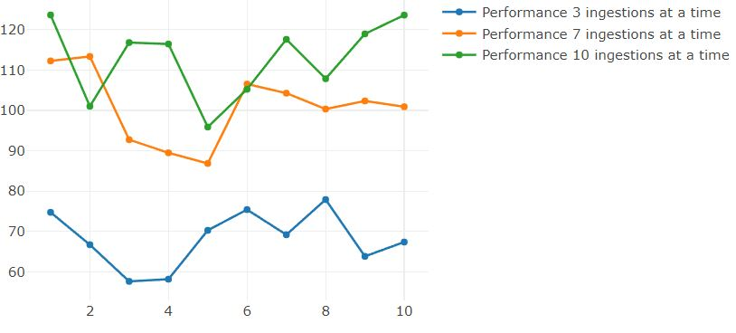

# Assignment report

## Design of the big data platform

##### 1.
- Time series analytics of IoT sensor data made up of air quality measurements. Data is processed as JSON documents according to document-oriented model. This type of data is easy and efficient to store in a NOSQL database, so the technology chosen for mysimbdp-coredms is MongoDB. MongoDB is very easy to deploy and scale while also working really well with JSON data Especially when we have a lot of small sensors that differ slightly, it is easier to store them according document-oriented model than using a relational database with a very strict schema.
Time series analytics could also be done using different NOSQL Databases, Relational Databases like Cassandra and CockroachDB or Time Series Databases specifically designed for time series data.
- Data source is sensors measuring air quality and the data is collected from an API that sends the data as JSON or CSV types.

##### 2.
Components:
- mysimbdp-coredms: Store and manage data, platform-as-a-services (PaaS), MongoDB. Shared instances for tenants. Large document database for the Iot data that gets updated at regular intervals.
- mysimbdp-daas: Api call handler for API calls to mysimbdp-coredms, platform-as-a-services (PaaS). Dedicated instances for tenants. Tenants can give either the url of a data source to send a HTTP GET request to or insert their own data through the client that is inserto into Kafka.
- mysimbdp-dataingest: Data ingestion from data sources of tenants/customers to mysimbdp-coredms through API calls. Tenant data inserted to Kafka creates Producers and Consumer, that connect to defined Brokers, have access to function calls from dataService.js that send HTTP requests which are catched by dataRouter.js which sends the requests to mysimbdp-coredms (mongoDB) where the data from HTTP requests bodies gets stored. dataService.js and dataRouter.js work through a REST-API. 

##### 3.
- 1 node when it should be 3 connected through a network.

##### 4.
- Data replication is set to 3 in Kafka Brokers, because this prevents the loss of data due to single point of failure, while being efficient enough to not require too many resources to run or waste. Should add 3 replication nodes for each mongo database defined (is not done here properly). Here only one node.

##### 5.
- mysimbdp-dataingest is deployed to client-side so tenants can push data into mysimbdp through mysimbdp-dataingest. Pretty much a Web-application with an open API that can be posted to and asked data from. Easy to access from anywhere. Deployment costs can get heavy over time.

## Implementation

##### 1.
Tenant data is stored as JSON documents in mysimbdp-coredms according to the document-oriented database model.
Example of data Schema based on used data source: Open data about air quality monitoring from Germany (https://github.com/opendata-stuttgart/meta/wiki/EN-APIs)
{
    id: String,
    sampling_rate: String,
    timestamp: String,
    location: {
      id: String,
      latitude: String,
      longitude: String,
      altitude: String,
      country: String,
      exact_location: String,
      indoor: String
    },
    sensor: {
      id: String,
      pin: String,
      sensor_type: {
        id: String,
        name: String,
        manufacturer: String
      }
    },
    sensordatavalues: [{
      id: String,
      value: String,
      value_type: String
    }]
}

##### 2.
- Data is stored as JSON documents as seen above. The inserted data is stored split into singular documents based on each sensor. These can be received with the sensors id or by querying other qualities. Data could be grouped by location or similar to improve database performance and speed up querying.

#####  3.
- The the atomic data element/unit to be stored are the singular IoT sensors datapoints as JSON documents. They are stored one at a time sending each one through a Kafka Producer and Consumer as a message.
- Eventual consistency.

#####  4.
Test results of concurrent mysimbdp-dataingest writing data into mysimbdp-coredms at concurrent amounts 3, 7 and 10 (only one node sadly):

- x-axis is the measurement point and y-axis seconds taken to fulfill ingestion.
Performance differences:
- Pretty clear to see that as the amount of concurrent ingestions happen the more time it takes to complete all tasks.

#####  5.
- Deployment reguires more parallerism with the mysimbdp-coredms nodes and sharding. More resources to parallelise data ingestion would improve performance also. Running locally caps performance at machine CPU capacity. Could have increased the nodes if I got the configuration working or if I paid money to get more nodes on mongoDB Atlas or similar service.

## Extension

#####  1.
To support data lineage, you would want to track the following metadata:
- Source Information
- Timestamp
- Version
{
  "source-mysimdbp-coredms": "mongo",
  "timestamp": "2024-02-16 00:51:02",
  "_v": "0",
}

#####  2.
{
  "tenant_id": "1234",
  "service_type": "mongodb",
  "service_name": "mongo",
  "endpoint": "mongo:27017",
  "status": "Running",
  "metadata": {
    "_v": "0",
    "environment": "production"
  }
}

#####  3.
- mysimbdp-dataingest would register itself on the service registry with its network location and other info. Client could query available instances from the service registry to find the network location of mysimbdp-dataingest or mysimbdp-coredms when needed for connection.

#####  4.
- I would integrate mysimbdp-dataingest to be a part of mysimbdp-daas or so mysimbdp-daas transfers the authentication to mysimbdp-dataingest and uses it to read and write data into mysimbdp-coredms.

#####  5.
- Hot data space would be more expensive and faster to read and write from. Would be great for data that is added recently or requested often.
- Cold space would be cheaper and slower with conditions for accessing data. Here is where old data like history of the system would be stored.
- I would support automatically moving/extracting data from a hot space to a cold space by having a lifecycle for data. If data has not been accessed for 30 days then move it to cold space.
